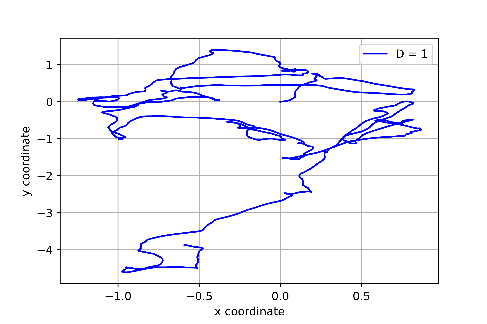
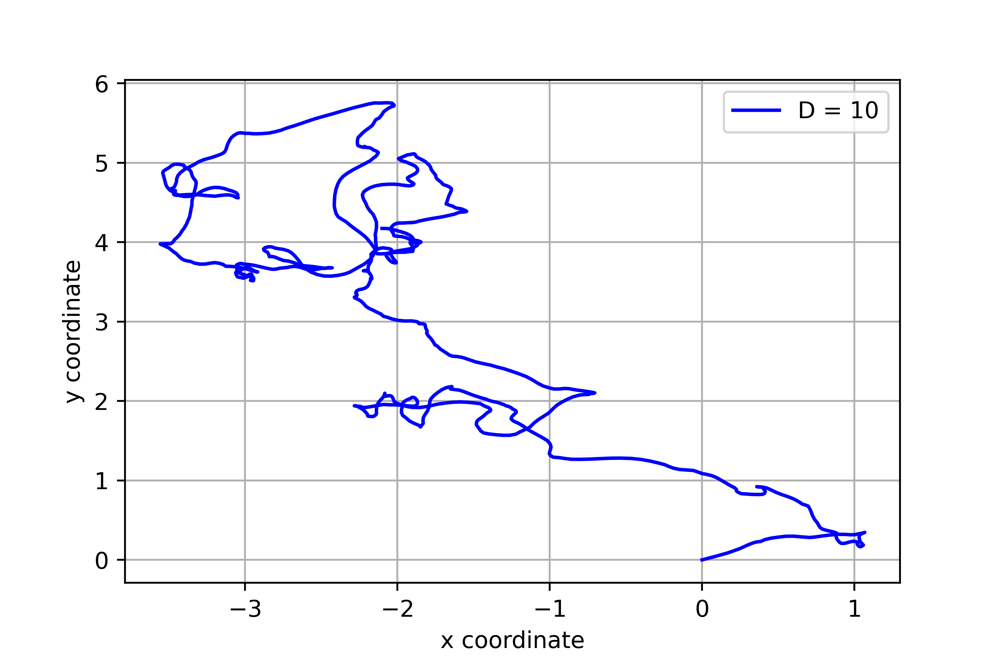

# Brownian-motion
Simulating Browninan motion of a particle in a 2D plane that obeys the Langevin equation

Refer to the problem.pdf question 3 for full question.

The  particle follows the Langevin equation mentioned in the above pdf. The randomness is modelled as Gaussian white noise. We use numpy.random.normal function to generate it.
Check the jupyter notebook for the code.
Image D.png shows one such scenario.

## Brownian motion with D=1

## Brownian motion with D=2

